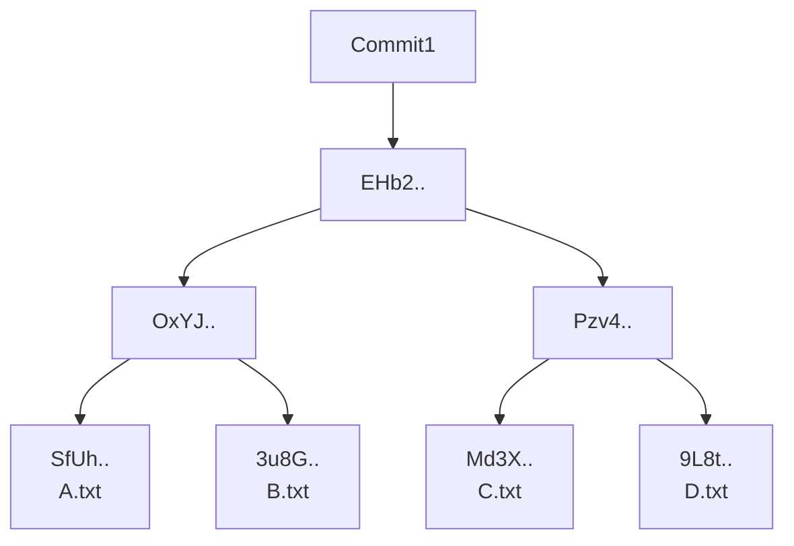
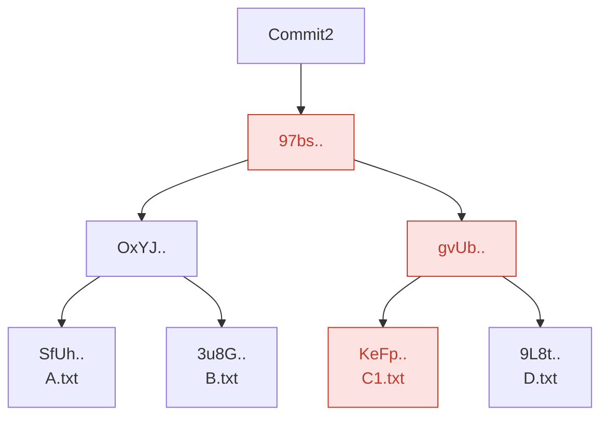
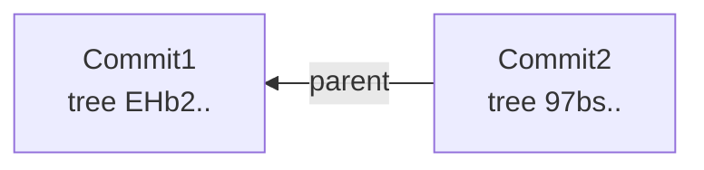
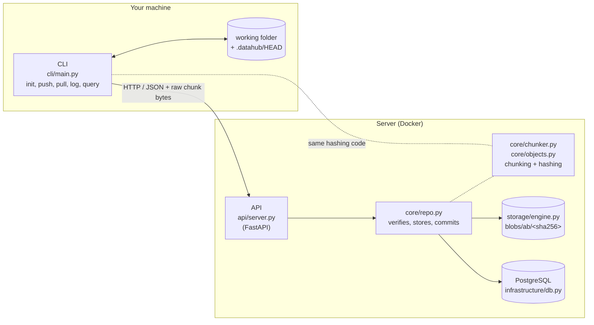
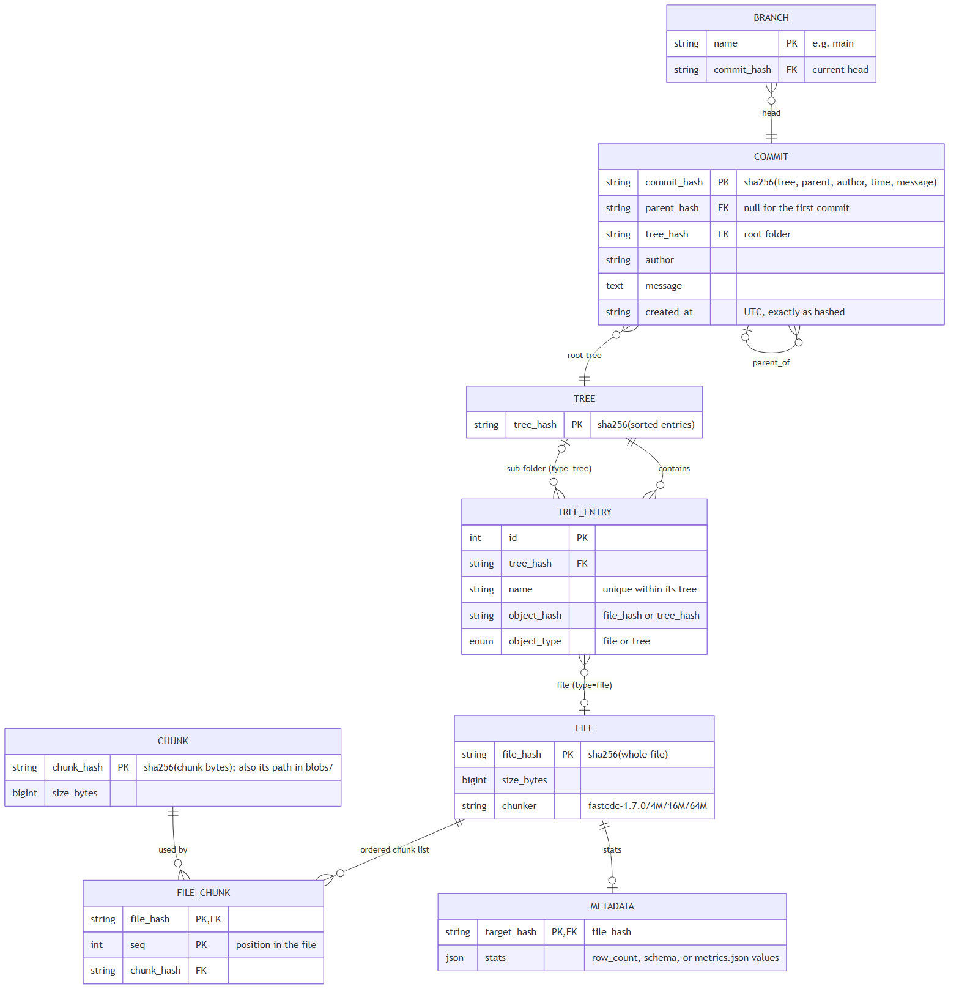

# DataHub: version control for datasets

DataHub versions large datasets the way Git versions code, but it stores **only the parts of a file that changed**. Edit one row of a 10 GB CSV and the next version costs roughly one 16 MiB chunk of new storage, not another 10 GB.

| Read this | If you want to |
|---|---|
| [TUTORIAL.md](TUTORIAL.md) | use DataHub: set up, push, pull, query (step by step) |
| [DEVELOPMENT.md](DEVELOPMENT.md) | work on the code: environment, tests, conventions |
| [live_demo_workspace/LIVE_DEMO.md](live_demo_workspace/LIVE_DEMO.md) | run the live terminal demo |
| [DataHub.pdf](DataHub.pdf) | see the original presentation this design follows |

## Contents
1. [The design, step by step](#1-the-design-step-by-step) (follows the presentation, then two steps beyond it)
2. [Architecture](#2-architecture)
3. [How push and pull work](#3-how-push-and-pull-work)
4. [Database structure](#4-database-structure)
5. [API reference](#5-api-reference)
6. [Safety guarantees](#6-safety-guarantees)
7. [Metadata and query](#7-metadata-and-query)
8. [Known limitations](#8-known-limitations)
9. [Team and modules](#9-team-and-modules)

---

## 1. The design, step by step

Each step adds one idea. Steps 1 to 7 follow the slides in [DataHub.pdf](DataHub.pdf). Steps 8 and 9 go beyond them and explain two choices made while building it.

### Step 1: A Merkle tree (slide 2)

A **Merkle tree** gives every file and folder a fingerprint (a hash) computed from its content. A folder's hash is computed from its children's hashes, so the **root hash fingerprints the whole snapshot**: change any byte anywhere and the root changes.



**In DataHub** ([core/objects.py](core/objects.py)), each folder is a *tree* whose hash covers its entries sorted by name:

```text
tree_hash = sha256("datahub-tree-v1\n" + "<type> <hash> <name>\n" for each entry, sorted by name)
            type is "file" or "tree"
```

Sorting makes the hash independent of the order the OS lists files in. Names are Unicode-normalised (NFC) so the same visible name hashes the same on Windows, macOS and Linux.

### Step 2: Change one file (slide 3)

Change `C.txt` to `C1.txt` and only the hashes **on the path from that file to the root** change (red). Every other folder keeps its hash, so it is reused, not stored again.



DataHub builds trees bottom-up and inserts them with "insert if not already there", so unchanged folders (`OxYJ..`) are never stored twice, and two identical folders in one snapshot are stored once.

### Step 3: Connect the snapshots: commits (slide 4)

A **commit** records one snapshot: its root tree plus a pointer to the previous commit. That pointer makes history a chain.



```text
commit_hash = sha256("datahub-commit-v1\ntree <root>\nparent <parent or none>\nauthor <a>\ntime <UTC>\n\n<message>")
```

- The parent is **inside** the hash, so a commit can't be moved to a different history without changing its hash.
- The newer commit points back to the older one (the slide's arrow shows the timeline; the stored pointer goes child → parent).
- A branch (`main`) names the newest commit. Each working copy remembers the commit it last pushed or pulled in `.datahub/HEAD`; a push is only accepted if `main` still points there, otherwise the server answers **409 "pull first"**, so nobody silently overwrites someone else's work.

### Step 4: Content-addressable storage (slides 5–6)

| Traditional storage (location-based) | Content-addressable storage (hash-based) |
|---|---|
| A file is found by its **path** (`/var/datasets/v1/data.csv`) | A file is found by the **SHA-256 of its content** |
| Contents can change silently under the same path | The address *is* an integrity proof: different bytes, different address |
| Identical copies at two paths are stored twice | Identical content has one address, so it is stored once |

**In DataHub** ([storage/engine.py](storage/engine.py)) every stored piece lives at `blobs/<first 2 hex>/<sha256>`. The server re-hashes every upload and rejects it if the bytes don't match the address; clients re-hash every download.

### Step 5: The problem: the whole file is still the unit (slide 7)

| Hash | Content |
|---|---|
| SfUh | A |
| 3u8G | B |
| Md3X | C |
| 9L8t | D |
| **KeFp** | **C1** (stored as a separate, complete file) |

Content addressing removes *exact* duplicates, but `C1` differs from `C` by one row, so it is a new hash and a **complete new copy**. For a 10 GB dataset: v1 + v2 = **20 GB**.

### Step 6: Chunking: the file becomes an index table (slides 8–9)

Split each file into chunks and store **chunks** by their hash. The tree's leaf is no longer the file's bytes but its **index table**: the ordered list of its chunks.

| Chunk # | Chunk hash (= its storage address) |
|---|---|
| 1 | rG8n.. |
| 2 | 9qYM.. |
| 3 | u4FT.. |
| … | … |
| N | ac54.. |

In content-addressable storage the chunk hash *is* the address, so the slide's separate `BLOB_Addr` column collapses into one value. In the database this table is `file_chunk(file_hash, seq, chunk_hash)`.

DataHub hashes **two things**, in a single read pass:
- the **whole file** (`file_hash`): "does the server already have this exact file?" One lookup skips all chunk work for unchanged files;
- **each chunk** (`chunk_hash`): what is actually stored and deduplicated.

### Step 7: Store only the new chunks (slides 10–11)

Modify the file and only the chunk(s) containing the change get new hashes; everything else is already stored.

| Chunk # | Chunk hash | |
|---|---|---|
| 1 | rG8n.. | already stored |
| 2 | 9qYM.. | already stored |
| 3 | u4FT.. | already stored |
| **6** | **bvrE..** | **new: the only chunk uploaded and stored** |
| … | … | already stored |

**Advantage:** a 10 GB dataset with one edited region costs about 10 GB plus one chunk, not 20 GB (the slide's "10.8 GB" example). Measured in this repo:

| Run | First push | Second push after an edit |
|---|---|---|
| 40 MB file, one row inserted near the top | 4 chunks, 40 MB | **1 of 4 chunks** uploaded |
| [Tutorial](TUTORIAL.md) `big.csv` (55 MB, 2M rows), one row inserted near the top | 5 chunks, 55 MB | **1 chunk, 13 MB**; all versions total 110 MB, stored 68 MB |
| Simulation workspace (`mock_workspace/simulate_datahub.py`) | 6 files, 329,003 bytes | **435 bytes** (unchanged 0.33 MB CSV skipped entirely) |

### Step 8 (beyond the slides): why *content-defined* chunking

The slides cut files into **fixed** 16 MB pieces. That works when an edit keeps the file's length, but datasets change by **inserting or deleting rows**, and that breaks fixed chunks:

```text
Fixed-size chunks, before:  | AAAA | BBBB | CCCC | DDDD |
Insert one row "x" early:   | AxAA | ABBB | BCCC | CDDD | D       <- every boundary shifted:
                                                                     every chunk is "new"
Content-defined, before:    | AAAA | BBBB | CCCC | DDDD |
Insert one row "x" early:   | AxAAA | BBBB | CCCC | DDDD |         <- boundaries follow the content:
                                                                     only the first chunk is new
```

With fixed chunks, one row inserted near the top of a 10 GB file makes **every** following chunk different: you store ~10 GB again, exactly the problem chunking was meant to solve.

**Content-defined chunking (CDC)** places boundaries where the *content* matches a pattern, not at fixed offsets. DataHub uses **FastCDC** ([core/chunker.py](core/chunker.py), library `fastcdc==1.7.0`):
- A cheap rolling "gear" hash runs over the bytes (`h = (h >> 1) + GEAR[byte]`); a boundary is placed where `h & mask == 0`.
- Because a boundary depends only on the bytes just before it, an insertion moves the boundaries near it and **the rest re-synchronise**: later chunks keep their hashes.
- It is **deterministic**: the same bytes with the same settings give the same chunks on every machine (checked: identical boundaries on Windows and Linux). Two users with the same file get the same chunks and deduplicate against each other.
- The gear hash only *finds* boundaries; **SHA-256** still identifies every chunk and file.

Evidence: in the tests, inserting bytes near the start of a file re-stores at most 3 of ~80 chunks; with the real sizes, inserting one row into a 40 MB file re-uploaded 1 of 4 chunks.

### Step 9 (beyond the slides): choosing the sizes: 4 / 16 / 64 MiB

FastCDC takes a minimum, an average (target) and a maximum chunk size. DataHub uses:

| Setting | Value | Why | Trade-off |
|---|---|---|---|
| **Average** | **16 MiB** | Matches the presentation, and DataHub targets **large** datasets: 1 TB is ~65,000 chunks (rows, files, HTTP requests). At 1 MiB it would be ~1,000,000 of each. Per-chunk overhead (one DB row, one request, one hash lookup) stays negligible. | One edit re-stores the whole chunk around it: ~16 MiB on average. That is 0.16% of a 10 GB file, but a large share of a 40 MB file. Accepted: the target is large data. |
| **Minimum** | **4 MiB** (avg ÷ 4) | FastCDC never cuts before this, so there are no tiny chunks bloating the index, and it skips boundary scanning for the first 4 MiB of each chunk (faster). | Files under 4 MiB are a **single chunk**: they deduplicate as whole files only (in the live demo, adding one row to the ~300-byte `experiments.csv` re-uploads that whole file, 337 bytes). |
| **Maximum** | **64 MiB** (avg × 4) | Forces a cut even in data with no natural boundaries (e.g. long runs of zeros). Bounds memory: a chunk is held in memory at most once while uploading, downloading or verifying, and the server rejects bodies above it (HTTP 413). | Worst case, one edit costs 64 MiB. |

min = avg/4 and max = avg×4 is FastCDC's standard "normalised chunking" spread, which keeps most chunks close to the average.

**These values are permanent.** Chunks only deduplicate against chunks made with the same settings, so changing them later would make every new version look new against all stored data. They are therefore:
- constants in [core/chunker.py](core/chunker.py), not user options;
- recorded with every file (`file.chunker = "fastcdc-1.7.0/4M/16M/64M"`); the server rejects uploads from a different chunker;
- protected by a test that fails if a library upgrade moves any boundary (`test_boundaries_are_pinned` in `core/tests/test_core.py`).

---

## 2. Architecture



- The CLI and the server share **one** implementation of chunking and hashing (`core/`), so they always compute the same hashes; the server recomputes everything a client claims.
- The CLI never touches the database; everything goes through the API.
- The database records *what exists and how it fits together*; chunk bytes live on disk. A chunk is recorded in the database only **after** it is safely on disk.

## 3. How push and pull work

**`datahub push <server> -m "message"`** ([cli/main.py](cli/main.py))
1. Scan the folder (paths with `/`, skipping `.datahub`, `.git`, `__pycache__`, `venv`, `.venv`) and chunk every file, hashing chunks and whole files in one pass.
2. `POST /files/exists`: files the server already has are skipped entirely.
3. `POST /chunks/missing`: of the remaining files' chunks, which does the server lack?
4. `PUT /chunks/{hash}` for each missing chunk (each once, even if several files share it).
5. `POST /files/` registers each new file as its ordered chunk list, plus its stats (row count, schema, metrics).
6. `POST /commit/` with `{path: file_hash}`, the parent (`.datahub/HEAD`), author, message and time. The **server** builds the Merkle trees, computes the commit hash and moves `main` only if it still points at the parent (else 409).
7. On success `.datahub/HEAD` is updated. Output shows files new/total, chunks uploaded/total, bytes uploaded/total.

**`datahub pull <server> [--force]`**
1. `GET /branches/main` gives the newest commit; `GET /commits/{hash}` gives its `{path: file_hash}` list, and the list for the commit in `.datahub/HEAD`.
2. Per path, compare **remote now**, **what you last had** and **your disk**:
   - the remote didn't change it: **left as you have it** (your edits and deletions survive);
   - you didn't change it: updated or deleted to match the remote;
   - **both** changed it: a conflict. Nothing is touched; the files are listed. `--force` takes the remote version.
3. Each file is downloaded chunk by chunk into a temp file, every chunk hash and the whole-file hash are checked, then the file is swapped in atomically. Paths that would land outside the folder are refused.
4. `.datahub/HEAD` is updated only after every file is in place, so an interrupted pull can simply be re-run.

## 4. Database structure



| Table | Columns | Holds |
|---|---|---|
| `branch` | `name` PK, `commit_hash` FK | Named pointer to the newest commit (`main`). |
| `commit` | `commit_hash` PK, `parent_hash` FK (null for the first), `tree_hash` FK, `author`, `message`, `created_at` | One snapshot. `created_at` is stored exactly as it was hashed, so the hash can always be recomputed. |
| `tree` | `tree_hash` PK | One folder (Merkle node). |
| `tree_entry` | `id` PK, `tree_hash` FK, `name`, `object_hash`, `object_type` (`file`/`tree`); unique `(tree_hash, name)` | A folder's contents: files and sub-folders. |
| `file` | `file_hash` PK, `size_bytes`, `chunker` | One file version, identified by the SHA-256 of its whole content. |
| `file_chunk` | `file_hash` + `seq` PK, `chunk_hash` FK | The index table: which chunks make up a file, in order (slide 9). |
| `chunk` | `chunk_hash` PK, `size_bytes` | One stored chunk; its bytes are at `blobs/<first 2 hex>/<chunk_hash>`. |
| `metadata` | `target_hash` PK + FK → `file`, `stats` (JSON) | Stats of a file version: row count, schema, or a `metrics.json`'s values. |

Integrity rules enforced by the database itself:
- Foreign keys are **deferred** (checked at commit), so a commit, its trees and its files can be inserted in any order within one transaction.
- Chunk, file, tree and metadata rows are inserted with "insert if absent" (`ON CONFLICT DO NOTHING`), so concurrent pushes of the same content never collide.
- `main` moves with a compare-and-swap (`UPDATE ... WHERE commit_hash = <expected parent>`): of several simultaneous pushes exactly one wins (tested with 8 at once on Postgres).

## 5. API reference

All hashes are 64-character lowercase SHA-256 hex; anything else gets **400**.

| Method & path | Request | Response | Purpose |
|---|---|---|---|
| `POST /files/exists` | `{"hashes": [...]}` (≤ 10,000) | `{"existing": [...]}` | Which whole files are already stored |
| `POST /chunks/missing` | `{"hashes": [...]}` (≤ 10,000) | `{"missing": [...]}` | Which chunks still need uploading |
| `PUT /chunks/{hash}` | raw chunk bytes | `{"stored": hash}` | Upload one chunk; 400 if the bytes don't match the hash, 413 if over 64 MiB |
| `POST /files/` | `{"files": [{file_hash, size, chunker, chunks: [{hash, length}], stats?}]}` | `{"registered": [...]}` | Record files as ordered chunk lists (every claim verified) |
| `POST /commit/` | `{parent_hash, files: {path: file_hash}, author, message, time}` | `{"status", "commit_hash"}` | Build trees, record the commit, move `main`; **409** if `main` moved |
| `GET /branches/{name}` | | `{name, commit_hash}` | Current head (404 if no commits yet) |
| `GET /commits/{hash}` | | commit fields + `files: {path: file_hash}` | A snapshot's file list (used by pull) |
| `GET /files/{hash}` | | `{file_hash, size, chunks: [{hash, length}]}` | A file's chunk list |
| `GET /chunks/{hash}` | | raw bytes (streamed) | Download one chunk |
| `GET /log` | | `{"history": [...]}` | History of `main`, newest first |
| `POST /query/` | `{"query": "accuracy > 0.9"}` | `{commit_hash, results: [{path, file_hash, stats}]}` | Filter the latest commit's files by a stat |

Errors: **400** invalid input or a claim that doesn't check out, **404** unknown hash, **409** someone pushed first, **413** chunk too large, **422** malformed request body.

## 6. Safety guarantees

| Risk | What prevents it |
|---|---|
| Corrupt or tampered upload | Server re-hashes every chunk; a file is recorded only after its chunks re-assemble to its declared hash |
| Half-written chunk after a crash | Chunks are written to a temp file and atomically renamed into place |
| Corrupt or tampered download | Client checks every chunk hash and the whole-file hash before swapping the file in |
| Two people pushing at once | Compare-and-swap on `main`; the loser gets 409 and nothing of theirs is half-saved |
| `pull` destroying unpushed work | Only paths changed on *both* sides conflict, and conflicts stop the pull before anything is written |
| A server sending `../` paths | `pull` refuses any path that resolves outside the working folder |
| Path tricks via hashes | Every hash must be 64 lowercase hex characters before it is used as a file name |

## 7. Metadata and query

On `push` the CLI extracts stats for **new** files ([metadata/extractor.py](metadata/extractor.py)) and sends them with the file:
- **CSV**: row count (constant-memory newline count) and column types from a 100-row sample;
- **Parquet**: row count and schema from the file footer only (never loads the data);
- **JSON**: a flat object such as `metrics.json` is stored as-is (`accuracy`, `loss`, …); other JSON gets a row count and schema.

Stats belong to the **file content** (`metadata.target_hash = file_hash`): same content, same stats.

`datahub query <server> "accuracy > 0.9"` searches the files of **`main`'s latest commit** and prints matching paths:

```text
models/metrics.json | {'format': 'json', 'accuracy': 0.94, 'loss': 0.05}
```

Supported operators: `>`, `<`, `>=`, `<=`, `==` on numeric values. Queries are built with SQLAlchemy expressions, never string concatenation.

## 8. Known limitations

- **Coarse edits on mid-sized files:** one edit costs ~16 MiB (see step 9); files under 4 MiB deduplicate only as whole files.
- **Compressed formats** (Parquet, gzip, zip) barely deduplicate with *any* chunker, because a small change rewrites most compressed bytes. FastCDC shines on CSV, JSON, TSV and other uncompressed data.
- **One branch (`main`), no merging.** After a real conflict you either push first or `pull --force`.
- `pull` downloads changed files in full, even if most of their chunks are already on your disk.
- `query` searches only the latest commit and compares numbers only.
- Stats are computed by the client; the server checks their shape and size (≤ 64 KB), not their truth. They describe data; they never affect it.
- No migrations: a schema change means recreating the database (`docker compose down -v`).
- No garbage collection yet: chunks no commit references are kept.

## 9. Team and modules

| Module | Path | Owner | Details |
|---|---|---|---|
| 1. Database & lineage | `infrastructure/` | Abinav Kiran | [infrastructure/README.md](infrastructure/README.md) |
| 2. Storage & deduplication | `storage/` | Aditya Khemka | [storage/README.md](storage/README.md) |
| 3. CLI | `cli/` | Kedar Medishetty | [cli/README.md](cli/README.md) |
| 4. API gateway | `api/` | Romir Shetty | [api/README.md](api/README.md) |
| 5. Metadata extraction | `metadata/` | Saurabh Kumar | [metadata/README.md](metadata/README.md) |
| 6. Query language | `query/` | Pashuvula Niranand Reddy | [query/README.md](query/README.md) |
| Core: chunking, hashing, repo logic | `core/` | shared | [core/README.md](core/README.md) |
